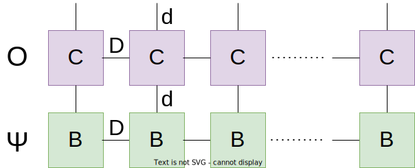

.. _mpo-classes:

*********************************************************
Matrix-product operators (:class:`MPO`, :class:`MPOList`)
*********************************************************

Similar to the MPS, the matrix-product operator is an efficient representation
of operators acting on quantum states, based on a tensor-network structure.

.. math::
    O = \sum_{\vec{i},\vec{\alpha},\vec{j}}
        \prod_{n=1}^N B_{\alpha_n,i_n,i_n,\alpha_n}
        \vert i_1,i_2\ldots i_N\rangle \langle j_1,j_2\ldots j_N\vert

As before, the :math:`i_n,j_n` are indices labelling quantum states of the `N`
subsystems, while the :math:`\alpha_i` are integer indices connecting
(correlating) neigboring quantum systems. The difference is that now this
models an operator, transforming quantum states from :math:`j_n` to :math:`i_n`
combinations.

In SeeMPS, matrix-product operators are represented by two classes, :class:`MPO`
and :class:`MPOList`, encoding either one operator :math:`O`, or a sequence of
them, :math:`O_{M-1} \cdots O_1 \cdot O_0`, in this order, as elements of an
MPO list `O[m]`.

.. _mpo_creation:

Creation
========

Matrix product states can be created by supplying the tensors that form the
state, and in the case of small wavefunctions, they can be reconstructed directly
from the state vector of the composite quantum state. In addition to this, we
offer modules offer specific operators for implementing quantum
:ref:`Fourier transforms <seemps_register>`, QUBO opertors, etc.
MPO's and their aggregates also can be scaled by a scalar, creating new objects
with transformed tensors. And finally, MPO's can be enlarged to include new
quantum subsystems---for instance, when you wish to implement a QFT onto a
set of qubits, the :py:meth:`~seemps.operators.MPO.extend` function allows you to do it.

.. autosummary::

    ~seemps.operators.MPO
    ~seemps.operators.MPOList
    ~seemps.operators.MPO.__mul__
    ~seemps.operators.MPOList.__mul__
    ~seemps.operators.MPO.extend
    ~seemps.operators.MPOList.extend

.. _mpo_application:

Application
===========

One of the advantages of matrix-product operators is that they can be efficiently
applied to matrix-product states, preserving the matrix-product form, and with
a cost that is linear in the system size. This is illustrated by the graph
below, sketching the contraction of an MPO (first row, 4-dimensional tensors)
with an MPS (lower row, 3-legged tensors).

The drawback of this contraction is that it results in potentially larger tensors.
Indeed, in the example above, a trivial contraction will create an MPS with
tensors of size :math:`dD\times d\times dD`.

We offer two functions to apply MPO's onto MPS'. The first one is the
:py:meth:`seemps.operators.MPO.apply`, which offers a lot of control on the contraction
and later simplification of the MPS (see
:doc:`simplification algorithm <algorithms/mps_simplification>`). The other alternative
is the matrix multiplication operator `@`, which relies on the strategy
stored in the state for contraction and simplification.

.. autosummary::

    ~seemps.operators.MPO.apply
    ~seemps.operators.MPOList.apply
    ~seemps.operators.MPO.__matmul__
    ~seemps.operators.MPOList.__matmul__
    ~seemps.operators.MPO.expectation

.. highlight:: python

As an example, consider the application of a quantum Fourier transform onto a
random MPS::

    >>> import seemps
    >>> mps = seemps.random_uniform_mps(2, 10)
    >>> mpo = seemps.qft.qft_mpo(10)
    >>> Fmps = mpo @ mps

The same can be done in a slightly more controlled way, as in::

    >>> Fmps = mpo.apply(mps, strategy=seemps.Strategy(tolerance=1e-9))

Note that there are dedicated functions to compute expectation values of
matrix product operators. Thus instead of using the slow contraction::

    >>> scprod(mps, mpo @ mps)

you should instead use the specialized algorithms::

    >>> mpo.expectation(mps)