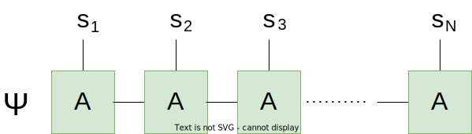
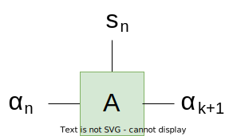
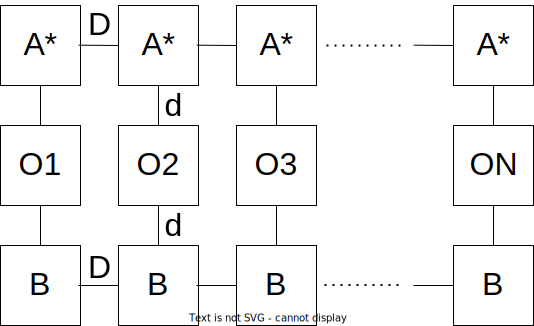

.. _mps_class:

************************************
Matrix-product states (:class:`MPS`)
************************************

The matrix-product state is an efficient representation of composite quantum
systems that reconstructs the total wavefunction from the contraction of
three-legged tensors.

If :math:`\Psi` is a quantum state with `N` components, a MPS representation
would look as follows

.. math::
    |\Psi\rangle = \sum_{\vec{i},\vec{\alpha}}
    \prod_{n=1}^N A_{\alpha_n, i_n, \alpha_{n+1}}
    |i_1,i_2,\ldots, i_N\rangle

Here, the :math:`i_n` are indices labelling the quantum states of the respective
subsystems, while the :math:`\alpha_n` are integer indices connecting
(correlating) neigboring quantum systems. The former are usually labeled the
"physical" indices, while the latter are declared "virtual" indices.

In SeeMPS, matrix-product states are represented by the class :class:`MPS`. The
instances of this class keep a sequence (list) of these three-legged tensors,
as well as other information, such as accumulated errors in this representation.
Such matrix-product states can be mutated, they can be added, rescaled,
renormalized, or they can be subject to quantum operations, such as gates
or the computation of observables.

Creation
========

Matrix product states can be created by supplying the tensors that form the
state, and in the case of small wavefunctions, they can be reconstructed directly
from the state vector of the composite quantum state. In addition to this, we
offer some functions to create convenience states

.. autosummary::

    ~seemps.state.MPS
    ~seemps.state.MPS.from_vector
    ~seemps.state.MPS.from_tensor
    ~seemps.state.AKLT
    ~seemps.state.GHZ
    ~seemps.state.product_state
    ~seemps.state.random_uniform_mps
    ~seemps.state.W

.. _mps_operations:

Simple operations
=================

Matrix product states can be combined with each other and transformed:

- An MPS `a` can be rescaled by a number `n * a`
- An MPS can be conjugated `a.conj()`
- Two MPS `a` and `b` can be added, producing an :class:`~seemps.state.MPSSum`
  (see :doc:`seemps_objects_sum`).
- The wavefunctions of two states can be multiplied element-wise `a * b`
  in an unphysical transformation.

.. _mps_expectation:

Observables
===========

The interest of MPS lays in its simple algebraic structure, which not only
involves a subexponential number of parameters, but also enables some operations
with a polynomial cost. One such operation is the computation of expected values
of local operators such as

.. math::
    \langle\psi|O_1 O_2 \cdots O_N|\psi\rangle

As sketched below, the expectation value is recovered from the contraction of
a quasi-1D structure, with a contraction cost :math:`O(N D^4)` that is linear
in the number of components, and polynomial on the bond dimension `D` and the
physical dimension `d` of each tensor.

The following functions provide access to single- and two-body expectation
values in a convenient way.

.. autosummary::

    ~seemps.state.scprod
    ~seemps.state.vdot
    ~seemps.state.MPS.norm
    ~seemps.state.MPS.norm_squared
    ~seemps.expectation.expectation1
    ~seemps.expectation.expectation2
    ~seemps.expectation.all_expectation1
